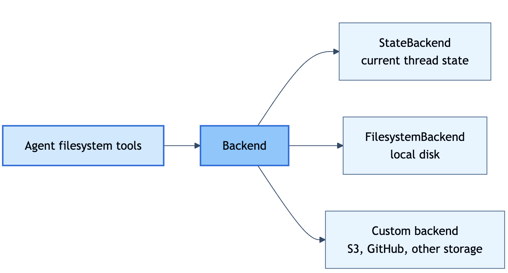
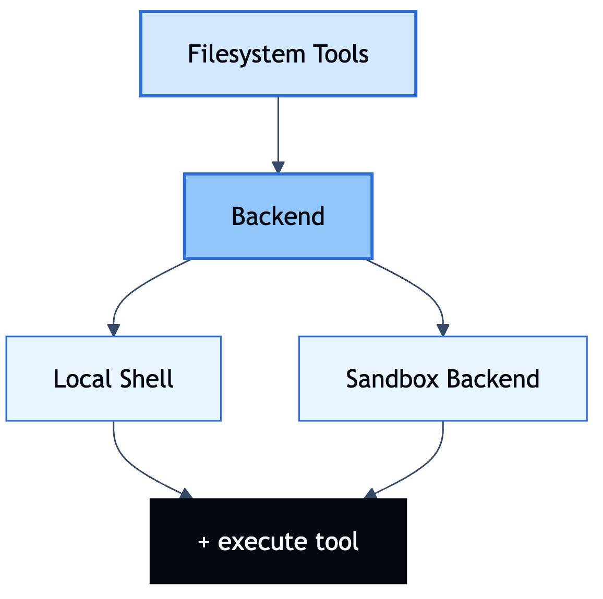
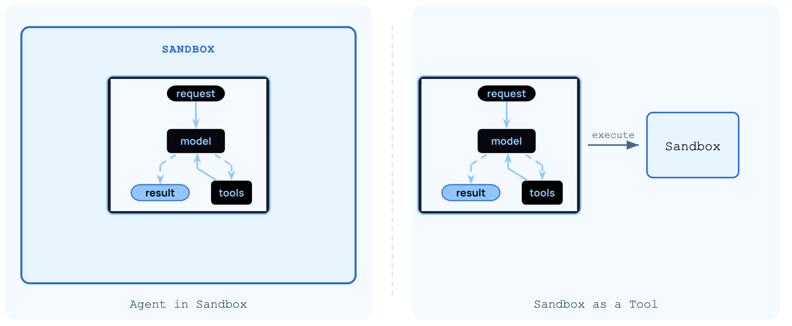

## Learning Goal  

Use the Deep Agents framework as a batteries included, opinionated framework to build effective custom agent harnesses without spending too much manual effort on making design decisions that have already been implemented probably better than I could by previous AI engineers which come up commonly in agent harness design.

> This learning is up to date for July 2026. There may be code from LangChain outside the deep agents SDK specifically that looks different than than older [LangChain Notes](./langchain) since LangChain as a whole has been updated/improved significantly over time, especially as a newer / less stable framework.

## What is Deep Agents?

Deep agents in a customizable agent harness that's purpose built for complex real-world tasks. 

Formally, an agent's **harness** is the structure of systems in which an agent operates that allows it to effectively complete its tasks. This can be broken down into four categories:
- Execution environment: can include a filesystem, sandboxes, and interpreters to execute code
- Context management: get the model the right context at the right time for the given task
- Delegation: tools to help plan long range task and delegate work to subagents
- Steering: prompts, and keeping a human in the loop to gate critical actions the agent takes

Ultimately, the job of a harness is to get the model the right context at the right time for the given task.

## Building a Deep Agent

Let's start with a simple agent thats just an LLM API call. It's just a deep agent by name since it's using the `create_deep_agent` function, but is the simplest possible form of a deep like like the old LangChain `create_react_agent` or newer `create_agent` we are well familiar with.

`m1/m1.2_scratch_agent.py`:
```python
from deepagents import create_deep_agent

from models import model

agent = create_deep_agent(model=model)

result = agent.invoke({"messages": [{"role": "user", "content": "What is an LLM?"}]})

print(result["messages"][-1].content)
```

`models.py`:
```python
load_dotenv(dotenv_path=Path(__file__).resolve().parent / ".env", override=True)

from langchain.chat_models import init_chat_model

model = init_chat_model("anthropic:claude-haiku-4-5")

# Will use this later
strong_model = init_chat_model("anthropic:claude-sonnet-4-6")
```

Running this with `uv run ./m1/m1.2_scratch_agent.py` yields the following output using Claude Haiku 4.5:

```
An LLM (Large Language Model) is a type of artificial intelligence system trained on massive amounts of text data to understand and generate human language.

**Key characteristics:**

- **Scale** — Trained on billions or trillions of tokens (words/subwords) from diverse text sources
- **Architecture** — Typically uses transformer neural networks with attention mechanisms to process language
- **Capabilities** — Can perform tasks like text generation, summarization, translation, question-answering, reasoning, and code generation without explicit task-specific training
- **Few-shot learning** — Often performs well on new tasks with just a few examples or instructions

**How they work:**

LLMs predict the next word (or token) in a sequence based on context. During training, they learn patterns, facts, reasoning abilities, and linguistic structure. At inference time, they generate text by repeatedly predicting the most likely next token.

**Examples:**

- GPT-4, GPT-3.5 (OpenAI)
- Claude (Anthropic) — which is what I am
- Llama (Meta)
- Gemini (Google)
- Mistral, Qwen, and others

**Limitations:**

- Can hallucinate or generate false information with confidence
- No real-time information (training data has a cutoff date)
- Prone to biases present in training data
- Can't truly "understand" — they're pattern-matching systems
- Computationally expensive to train and run

LLMs have become foundational to modern AI applications, powering chatbots, code assistants, content generation tools, and more.
```

> Running `uv run ./m1/m1.2_scratch_agent.py` executes that file directly as the program entry point, so inside the file Python sets `__name__ == "__main__"`  implicitly and runs the code immediately. This is similar to Java executing the class that contains `public static void main(String[] args)`, except Python can run a file by path without requiring it to be addressed as part of a package. In this mode, Python starts import lookup near the script location, but in your project it can also see the broader `python/` folder, which is why `from models import model` resolves to the top-level `python/models.py`. Running with `python -m ...` is closer to Java’s fully qualified package execution, like `java com.example.Main`: Python treats the file as a module inside a package and expects imports to line up more deliberately with that package structure. 

> Confusingly coming from Java, recall that in everyday Python, a **module** is (almost) always one `.py` file, while a folder containing multiple modules is a **package**. Familiarly in Java 9+ a module/project has packages which have files/classes/interfaces, equivalently in python a project has packages which have modules/files which may have classes in them. This means packages are analogous in both languages, but in Java modules are a level above packages while in python a level below.


#### System Prompt

Your system prompt goes into a deep agent like:

`m1/m1.4_scractch_agent_bulter.py (Sinppet)`:
```python
agent = create_deep_agent(
    model=model,
    system_prompt=SYSTEM_PROMPT,
    name="Butler Agent",
)
```

#### Tools

Some useful built in tools that are built in to the deep agents SDK:

| Tool(s)                                      | What it does                                          |
| -------------------------------------------- | ----------------------------------------------------- |
| `ls`, `read_file`, `write_file`, `edit_file` | Read and write files in the agent's working directory |
| `glob`, `grep`                               | Search files by name pattern or content               |
| `execute`                                    | Run shell commands (requires a sandbox backend)       |
| `task`                                       | Delegate work to a sub-agent with an isolated context |
| `write_todos`                                | Manage a running to-do list for multi-step planning   |

You can add tools to a deep agent like:

```python
agent = create_deep_agent(
    model=model,
    tools=[my_tool_a, my_tool_b],   # merged with the built-in tools (ls, grep, task...)
)
```

> Recall tools like `my_tools_a` are just functions decorated with `@tool`. The current way to do this is to use `langchain_core.tools.tool` to get the decorator.

#### MCP

From prior [LangChain](./langchain) lessons, we are familar with MCP servers and recall specifically as an example LangChain MCP server itself for giving coding agents up to date documentation on how to write LangChain; an incredibly useful tool since LangChain frameworks are new and update frequently. 

We can connect to MCP servers using an MCP Client object that will give us a list of tools to pass directly into the agent with clean syntax.

`m1/m1.6_agent_mcp.py (Snippet)`:
```python
from langchain_mcp_adapters.client import MultiServerMCPClient
from models import model

client = MultiServerMCPClient({
    "docs-langchain": {
        "transport": "http",
        "url": "https://docs.langchain.com/mcp",
    }
})
tools = await client.get_tools()

agent = create_deep_agent(model=model, tools=tools)
```

We can also setup authorization with OAuth like

```python
client = MultiServerMCPClient({
    "github": {
        "transport": "streamable_http",
        "url": MCP_URL,
        "auth": auth_provider,
    }
})
```

Where `auth_provider` is an instance of `mcp.shared.auth.OAuthClientProvider`. Note that `mcp` here is not explicitly declared in `pyporject.toml`, our manifest file, since `mcp` is a transitive dependency of `langchain-mcp-adapters`.

#### Messages, Threads, and Checkpointers

Deep agents make it easy to keep track of more than one model call. We categorize multi-turn behaviour into three runtime ideas: messages, threads, and checkpointers.

**Messages** look like:

`m1/m1.7_messages_threads_checkpointers.py (Snippet)`:
```python
result = agent.invoke({
    "messages": [{"role": "user", "content": "What is an LLM?"}]
})
```

The main three types of messages that come up with DeepAgents are:

| Message          | Where it comes from                                              |
| ---------------- | ---------------------------------------------------------------- |
| **HumanMessage** | The human's input, such as `{"role": "user", "content": "..."}`. |
| **AIMessage**    | The model's response. It can contain text or `tool_calls`.       |
| **ToolMessage**  | The result returned after the Tool Node runs a tool.             |
There are of course other messages like SystemMessage too, and other more exotic ones.

**Threads** are an ongoing conversation or run history. If you want an agent to remember previous turns across separate `invoke()` calls, give those calls the same `thread_id`.

```python
config = {"configurable": {"thread_id": "my-thread"}}

agent.invoke(
    {"messages": [{"role": "user", "content": "Remember my favorite color is blue."}]},
    config=config,
)

agent.invoke(
    {"messages": [{"role": "user", "content": "What is my favorite color?"}]},
    config=config,
)
```

**Checkpointers** save thread state between calls. Without a checkpointer, there is nowhere to store the history for later. For local dev, the simplest checkpoint is `MemorySaver()` which stores checkpoints in the running Python process. Proper persistent infrastructure is needed for threads to survive process restarts.

Checkpointers are what make multi-turn state reliable because they save the current thread, and the next call with the same `thread_id` to continue from that saved state

```python
from langgraph.checkpoint.memory import MemorySaver

agent = create_deep_agent(
    model=model,
    checkpointer=MemorySaver(),
)
```

#### Human-in-the-Loop

**Human-in-the-Loop (HITL)** is the idea that we should pause before a sensitive agent action and let a person approve, edit, or reject it. The main purpose for this is safety, to ensure the user is aware of potentially dangerous actions like sending an email, running a database query, deleting a file, etc. HITL lets the agent suspend exection while it waits instead of staying active indefinitely. 

There are four pieces to remember:

|Piece|What it does|
|---|---|
|`interrupt_on`|Names the tools that require human review before execution.|
|`checkpointer`|Saves the paused agent state. For local development, use `MemorySaver()`.|
|`thread_id`|Identifies the saved run state. Resume with the same `thread_id`.|
|`Command(resume=...)`|Continues the paused run with the human decision.|

## The Deep Agent Environment

A deep agent runs inside an environment where it can store files, run commands, and optionally execute code inside the agent loop.

A Deep Agent environment comes with:
- A filesystem for reading and writing files.
- A shell, optionally. Exposed through the `execute` tool when the environment supports command execution.
- An interpreter, optionally. A separate capability for running code inside the agent loop.

###### File System

A filesystem gives the agent a place to work. It can use files as a scratchpad for notes, intermediate results, plans, and generated artifacts.

Deep Agents always provide filesystem tools such as `ls`, `read_file`, `write_file`, `edit_file`, `glob`, and `grep`. The agent sees the same tool surface even if the backend implementation changes.

That backend detail matters when you care where files live, but this lesson only needs the core idea: the filesystem is always part of the environment.

###### Shell

A shell lets the agent run commands through the `execute` tool: scripts, tests, package commands, and other process-level work. This is powerful, so the implementation matters.

Different backends can provide different implementations of `execute`. Two common families are:

**Sandbox providers** run commands in isolated environments such as containers, VMs, or remote sandboxes. This limits what code can affect compared with running directly on your machine, but safety still depends on sandbox configuration, network access, credentials, and provider isolation.

**Local shell** runs commands directly on your machine. It has no isolation overhead and can access local resources, but it should be used only when that local access is actually required.

The key distinction: `execute` does not inherently mean to run locally; it runs wherever the configured backend says commands should run.

###### Interpreter

An interpreter is different from a shell. It does not run through the backend. It is a separate tool/capability inside the agent loop.

Use an interpreter when the agent needs code-like control flow without starting a full shell process. For example, instead of asking the model to call a tool 100 times, the interpreter can run a loop, collect intermediate results in variables, and return only the final summary to the model.

Most agent work alternates between model reasoning and tool calls. A model can fire several tool calls in one turn, but that batch is fixed the moment it is emitted. Nothing can loop, branch on a result, retry a failure, or feed one call's output into the next without another model turn, and every result returns to the model's context.

Interpreters give the agent a runtime for that work. A loop runs every iteration, intermediate values stay in variables, and only a compact result returns to the model.

#### Filesystem Backends

Now that you have seen the environment surface, we can name the implementation layer.

The **environment** is what the agent sees: filesystem tools, optional `execute`, and optional interpreter. The **backend** is what implements the filesystem and optional shell behind that environment.

A backend answers questions like:
- where do files live?
- is `execute` available?
- if `execute` is available, where do commands run?

There is an abstract backend interface with multiple implementations. Some implementations only provide filesystem storage. Some also provide shell execution. Shell execution can be backed by a local shell or by different sandbox providers.

The key point is that the agent's tool surface can stay the same while the backend changes. The agent can still call `read_file` or `write_file`; the backend decides what those calls mean underneath.

The interpreter is not part of this backend layer. It is a separate capability added to the agent loop.



You can select from different backends to implement:
- **StateBackend**: the default. Files live in the agent's saved state for the current thread. This is fast and zero-config, and it is good for scratch work.
- **FilesystemBackend / local disk**: reads and writes files on the local disk, scoped to a `root_dir` you specify. Use it when the agent should work with real files in a local directory.
- **CompositeBackend**: routes different path prefixes to different backends. It lets one agent use StateBackend for normal scratch files while routing a specific directory, such as `/reference/`, to local disk.
- **Custom backend**: implement the backend interface yourself to plug in another storage system, such as S3, GitHub, or a proprietary store.

Pass any backend directly to `create_deep_agent`. If you do not pass one, Deep Agents uses `StateBackend()` by default.

```python
from deepagents import create_deep_agent
from deepagents.backends import FilesystemBackend

agent = create_deep_agent(
    model=model,
    backend=FilesystemBackend(root_dir="/path/to/project", virtual_mode=True),
)
```

Sometimes one backend is not enough. You may want ordinary scratch files to stay in thread state, but a specific directory to map to real local files.

`CompositeBackend` resolves this by routing path prefixes to different backends. Everything not matched by a route falls through to the `default` backend.

```python
from pathlib import Path

from deepagents import create_deep_agent
from deepagents.backends import CompositeBackend, FilesystemBackend, StateBackend

reference_dir = Path(__file__).parent / "reference"

agent = create_deep_agent(
    model=model,
    backend=CompositeBackend(
        default=StateBackend(),
        routes={
            "/reference/": FilesystemBackend(
                root_dir=str(reference_dir),
                virtual_mode=True,
            ),
        },
    ),
)
```

> `/reference/notes.md` goes to a local file at `reference/notes.md`, Everything else goes to `StateBackend`, scoped to the current thread's saved state

###### Permissions

Permissions are enforced in code, not in the prompt. The model cannot bypass them. Pass a list of `FilesystemPermission` rules to `create_deep_agent`; rules are evaluated in order and the first match wins. If nothing matches, the operation is allowed.

Each rule has three fields:

| Field        | Values                             | Default   | Description                                                                                    |
| ------------ | ---------------------------------- | --------- | ---------------------------------------------------------------------------------------------- |
| `operations` | `"read"`, `"write"`                | -         | `"read"` covers `ls`, `read_file`, `glob`, `grep`. `"write"` covers `write_file`, `edit_file`. |
| `paths`      | glob patterns                      | -         | e.g. `["/reference/**"]`. Supports `**` and `{a,b}` alternation.                               |
| `mode`       | `"allow"`, `"deny"`, `"interrupt"` | `"allow"` | `"interrupt"` pauses for human approval instead of blocking.                                   |
```python
from pathlib import Path

from deepagents import FilesystemPermission, create_deep_agent
from deepagents.backends import CompositeBackend, FilesystemBackend, StateBackend

reference_dir = Path(__file__).parent / "reference"

agent = create_deep_agent(
    model=model,
    backend=CompositeBackend(
        default=StateBackend(),
        routes={
            "/reference/": FilesystemBackend(
                root_dir=str(reference_dir),
                virtual_mode=True,
            ),
        },
    ),
    permissions=[
        FilesystemPermission(
            operations=["write"],
            paths=["/reference/**"],
            mode="deny",
        ),
    ],
)
```

> The agent can read `/reference/`, but it cannot write to it. Other paths still use the default `StateBackend` route.

#### Sandbox and LocalShell Backends

The filesystem backends from the last lesson give the agent file tools: `ls`, `read_file`, `write_file`, `edit_file`, `glob`, `grep`. `LocalShellBackend` and sandbox backends add one more: **`execute`**, which runs shell commands.



Shell-capable backends expose an `execute(command)` tool. The agent calls it to run scripts it has written, invoke CLI tools, and compile and test code. The combined command output, exit code, and execution metadata come back as a tool result on the next LLM call.

###### How do you choose between LocalShell and Sandboxes?

Sandboxes are used for isolation. They are designed to let agents execute code, access files, and use the network away from your host machine. They are safer than running directly on your machine, but safety still depends on sandbox configuration, network access, credentials, and provider isolation.

In LangSmith Sandboxes, credentials are kept out of the sandbox entirely via an **auth proxy** pattern: the sandbox code makes API calls with no authentication headers, and a proxy sidecar intercepts outbound requests and injects the credentials on the way out. Secrets never enter the sandbox. The agent cannot exfiltrate what it cannot see.

Sandboxes are especially useful for:
- **Coding agents:** Agents that run autonomously can use shell, git, clone repositories (many providers offer native git APIs, e.g., Daytona's git operations), and run Docker-in-Docker for build and test pipelines
- **Data analysis agents:** Load files, install data analysis libraries (pandas, numpy, etc.), run statistical calculations, and create outputs like PowerPoint presentations in a safe, isolated environment

`LocalShellBackend` gives the agent access to the local filesystem and shell. Even with filesystem path scoping, the `execute` tool runs with host permissions; file scoping does not limit what shell commands can do. Unless your intention is to build a desktop agent designed to work on local files and commands, a sandbox is a better choice.

#### Sandbox Backends

A sandbox is a temporary, isolated workspace containing a filesystem, command execution environment, and other resources. Sandbox backends run commands inside that workspace instead of on your host machine.

There are two models for using a sandbox with an agent:



#### LocalShell Backends

`LocalShellBackend` runs commands directly on the host machine. It can scope filesystem _tools_ to a `root_dir`, but `execute` itself runs with host permissions; no process isolation is applied.

Use `virtual_mode=True` when you want filesystem tools (`ls`, `read_file`, `write_file`, etc.) to be path-scoped under `root_dir`. Either way, `root_dir` does not restrict the `execute` tool. Shell commands run with host permissions and can access paths outside the filesystem-tool root. That's why LocalShellBackend is unsuitable for production or untrusted input.

This backend grants agents direct filesystem read/write access and unrestricted shell execution on your host. Use with extreme caution and only in appropriate environments.

**Appropriate use cases:**

- Local development CLIs (coding assistants, development tools)
- Personal development environments where you trust the agent's code
- CI/CD pipelines with proper secret management

**Inappropriate use cases:**

- Production environments (such as web servers, APIs, multi-tenant systems)
- Processing untrusted user input or executing untrusted code

**Note:** `virtual_mode=True` provides no security with shell access enabled, since commands can access any path on the system.

## Interpreters

**Interpreters are a lighter-weight code execution option compared to backends.** They embed a JavaScript runtime directly in the agent loop with no cloud infrastructure and no API calls to spin up a shell environment. The tradeoff is a narrower direct capability set: JavaScript standard library only, no external packages, no direct filesystem, and no direct network access.

When `CodeInterpreterMiddleware` is added to an agent, it provides a single new tool: **`eval`**. The agent calls it with a string of JavaScript to execute. The middleware runs the code in a [QuickJS](https://bellard.org/quickjs/) runtime, a lightweight JavaScript engine designed for embedded execution. The result of the last expression, plus any `console.log` output, comes back as the tool result.

QuickJS makes the following JavaScript function / packages avaialble:
- Array methods: `map`, `filter`, `reduce`, `sort`, `flat`, `find`  
- `Map`, `Set`, `JSON`, `Math`, `Promise`  
- `Date` and other standard JavaScript globals  
- `console.log` (captured and returned as output)  
- String and number methods, destructuring, `async`/`await`

QuickJS does not have available:
- Filesystem (`fs`)  
- Network (`fetch`)  
- Node.js APIs  
- `npm` packages

The interpreter state persists across `eval` calls within the same thread. Variables defined in one call are available in the next.

Interpreter execution is bounded by runtime limits such as timeout, memory, output size, and PTC call limits. Those limits keep runaway loops or huge results from taking over the agent run.

Good use cases for interpreters includes:
- Data transformation: When the agent has data in context and needs to compute something (sort, group, aggregate, reformat), `eval` is faster and more reliable than asking the LLM to do arithmetic in prose.
- Programmatic Tool Calling (PTC): JavaScript code can call the agent's tools directly, without those intermediate results ever entering the LLM's context window

###### Interpreter vs shell-capable backend

| Capability         | Interpreter                                                               | Shell-capable backend / sandbox                                    |
| ------------------ | ------------------------------------------------------------------------- | ------------------------------------------------------------------ |
| Language           | JavaScript (QuickJS)                                                      | Any shell command or installed runtime                             |
| External libraries | JS standard library directly; more only through allowlisted tools         | Packages available in the environment                              |
| Filesystem         | No direct filesystem API; can only access files through allowlisted tools | Filesystem tools plus shell access when supported                  |
| Network            | No direct network API; can only access network through allowlisted tools  | Depends on backend and sandbox/network configuration               |
| Infrastructure     | Embedded in the agent process                                             | Local shell or external sandbox resource                           |
| State              | Persists within thread                                                    | Persists within the shell/sandbox workspace until reset or deleted |
| Best for           | Computation, loops, PTC orchestration                                     | Scripts, packages, file I/O, builds, tests, arbitrary shell work   |

Use an interpreter when the task is logic and orchestration. Use a shell-capable backend or sandbox when the task requires packages, filesystem operations from code, network access, or arbitrary command execution.
