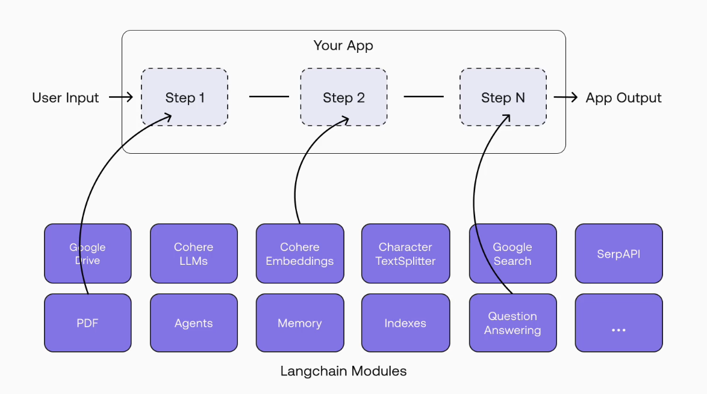
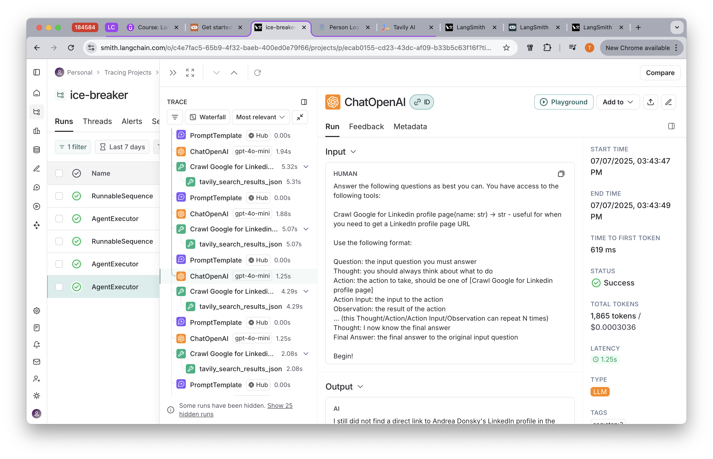
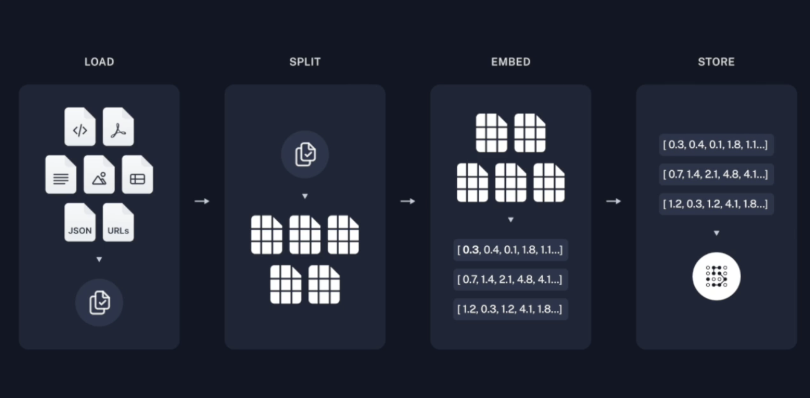
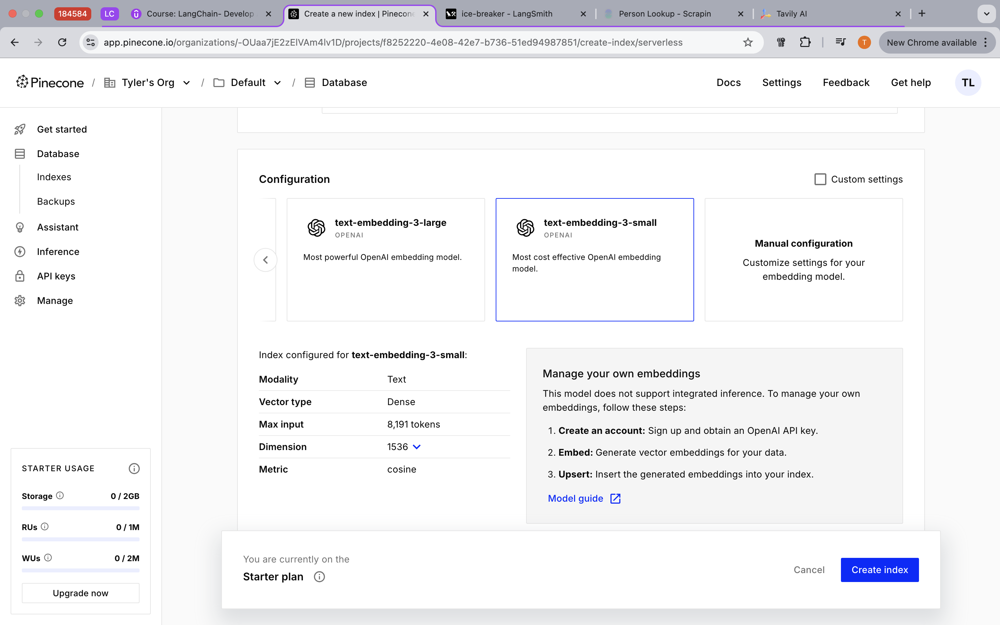
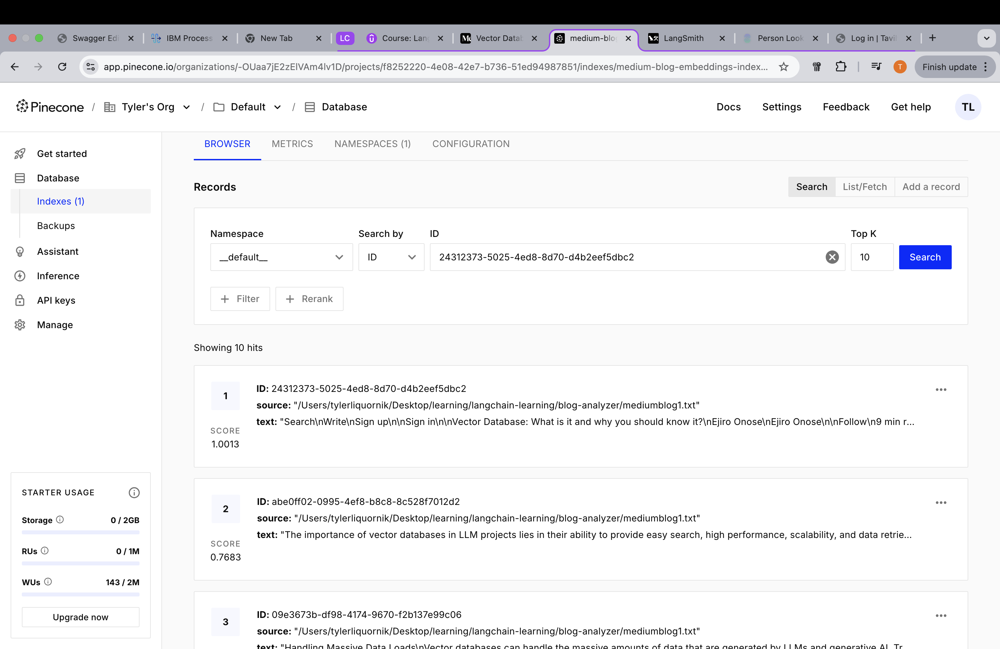
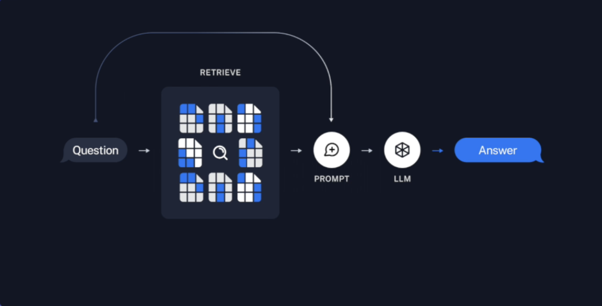
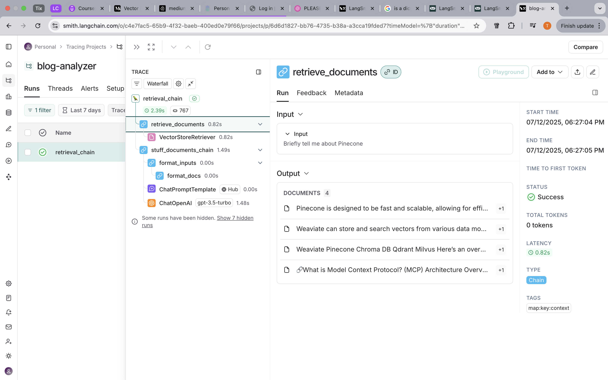
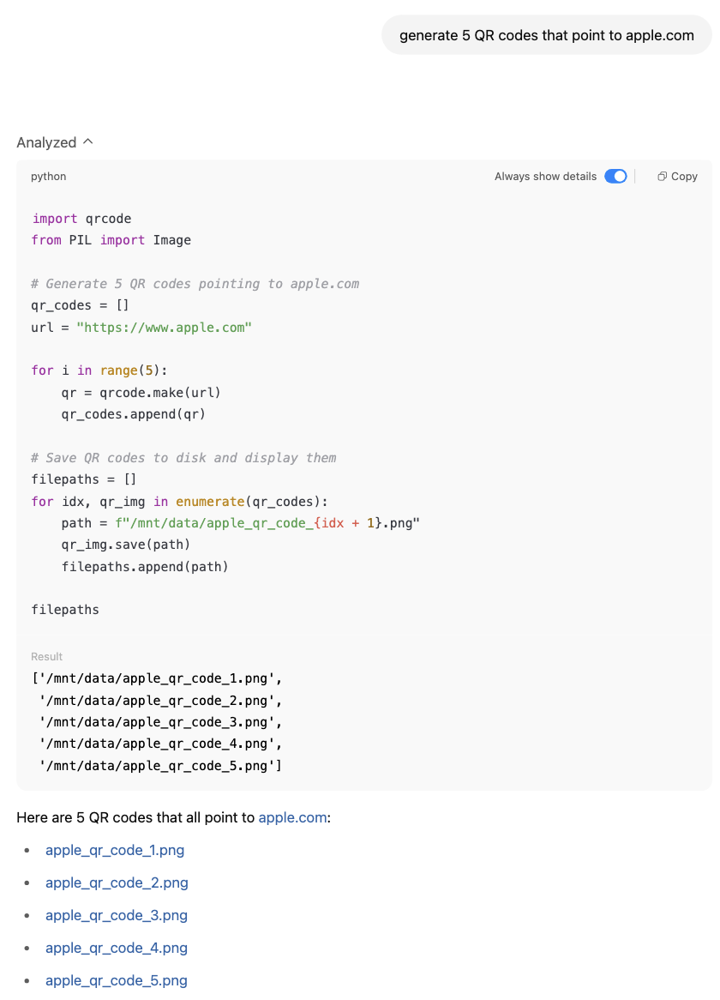
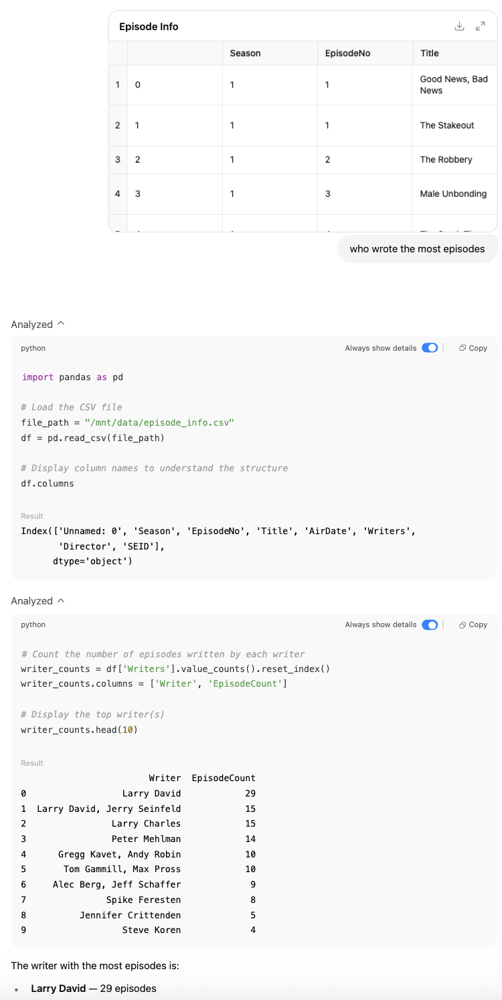
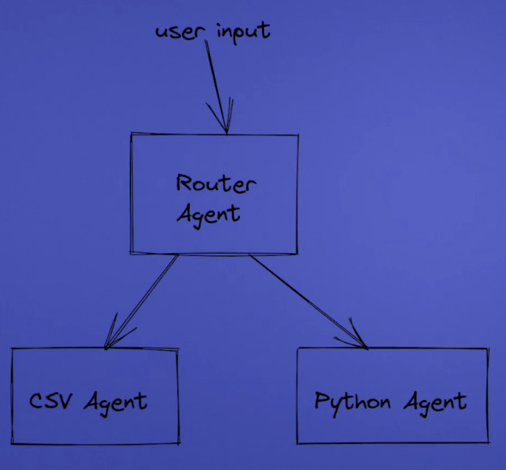

  
## Learning Goal  
  
The goal for this course is to be able to build AI applications in two domains: AI Agents, and Retrieval Augmented Generation. I would like to gain an understanding of the mechanisms that drive these applications under the hood, which means being adept at Prompt Engineering, and understanding the LangChain Ecosystem stack, like using LangSmith for tracing, and LangGraph for workflow engineering. In addition to all this, I'll cover how to create production ready LangChain apps, with enterprise concerns like testing, logging & monitoring, security, and more.  
  
Theres also gonna be some python basics in here, as I'm relatively new to building full fledged python applications that aren't just small scripts, and am writing from the perspective of a developer with more experience writing Java and JavaScript applications.  
  
> Note: This guide is updated for LangChain 0.3.3  
  
## What is LangChain?  
  
LangChain is an open source framework that simplifies the process of building LLM applications, with a set of useful abstractions that make it so we don't need understand the inner workings of LLMs, but rather use them as a blackbox for software engineering.  
  
One example of this is that it lets us switch between different LLMs extremely easily, using the same interface for every model. This helps very easily prevent vendor lock with object design around one specific model.  
  
```python  
from langchain_anthropic import ChatAnthropic  
from langchain_openai import ChatOpenAI  
from langchain_ollama import ChatOllama  
  
llm = ChatAnthropic(model='claude-3-opus-20240229')  
llm = ChatOpenAI(model="gpt-4o", temperature = 0)  
llm = ChatOllama(model="llama3.2")  
```  
  
Another topic is injecting external text into text prompts. This comes up often as we know, in things like context augmented generation, and we'll see it in RAG too.  
  
```python  
from langchain_core.prompts import PromptTemplate  
  
prompt_template = PromptTemplate.from_template("Tell me a joke about {topic}")  
prompt_template.invoke({"topic": "cats"})  
```  
  
There are also document loaders, for documents in many forms, like Notion databases, PDFs, emails, and more  
  
```python  
from langchain_community.document_loaders import NotionDirectoryLoader  
from langchain_community.document_loaders import PyPDFLoader  
from langchain_community.document_loaders import UnstructuredEmailLoader  
  
notion_loader = NotionDirectoryLoader("Notion_DB")  
notion_docs = notion_loader.load()  
  
pdf_loader = PyPDFLoader("your_file.pdf")  
pdf_docs = pdf_loader.load()  
  
email_loader = UnstructuredEmailLoader("example-email.eml")  
email_docs = email_loader.load()  
```  
  
There are many more features on top of these 3, these just scratch the tip of the iceberg!  
  
## Setting Up Your Environment  
  
Get Started by installing `pipenv` to use as our virtual environment and package manager. If you don't have it already, simply:  
  
```sh  
brew install pipenv
```  
  
And then in PyCharm, be sure to select the binary for pipenv under *Settings => Project: <project_name> => Python Interpreter*  
  
Startup the environment with `pipenv shell`, which either locates or creates your virtual-env, starts up a shell inside it, and configures a lot of the base environment variables for the env like `PATH`, `VIRTUAL_ENV`, and `PYTHONPATH` so things we run now properly execute inside the env.  
  
Now that the environment is setup, to get started with LangChain, lets install some dependencies to start us off. Start with the framework itself `pipenv install langchain`. In addition, we'll `pipenv install langchain-openai` to get OpenAI's third party LangChain integration package, and `pipenv install langchain-community` for a lot of useful community contributed code. Also `pipenv install langchainhub`, which includes a lot of community written prompts that you can easily snag from that already have good prompt engineering behind them.   
  
Aside from LangChain packages, there are some other packages to install too. `pipenv install python-dotenv` will give us easy access to env vars in `.env`, which we'll use often for things like LLM API keys. It has a dead simple API:  
  
```python  
from dotenv import load_dotenv  
import os  
  
if __name__ == "__main__":  
     # Call this once at the start    
     load_dotenv()    
     # API Key value accessible assuming its in .env   
     print(os.environ['API_KEY'])  
```  
  
As a bonus package, `pipenv install black`, for a linter, which you can just run right away with `black .` to keep our code neat.  
  
A lot of the reason for all these different packages is the refactoring  through diverse contributions over time since LangChain started. For example before `langchain-openai`, you had to use the whole OpenAI SDK separately, but now its more unified with official integration packages that each LLM vendor maintains directly with LangChain.  
  
## Prompts and LLM APIs  
  
Lets first start with two interfaces, `PromptTemplate`, and `ChatOpenAI`, which we can grab with:  
```python  
from langchain_core.prompts import PromptTemplate  
from langchain_openai import ChatOpenAI  
```  
  
Consider the prompt: `"I want you to write a cool funny jingle for a {product} product`. The jingle should be 1 sentence." We could use this to help the user generate some content, and we'd inject something like `product = sports shoes`, `product = piano`, or `product = cat food`.  
  
`PromptTemplate` wraps a prompt by allowing it to take input parameters, changing the outcome of a prompt sent to our LLM. We pass in two key parameters to start using `PromptTemplate`, `input_variables: list[str]` which is the list of `{placeholders}` to replace and `template: str` which is the prompt containing the placeholders.  
  
We use `PromptTemplate` among other abstractions to make LLM queries in what we call a **chain**. A chain is simply a way of combining together different steps in a workflow using AI across different steps, to transform an input into an output.  
  
  
  
We can create our first chain by piping our `PromptTemplate` into `ChatOpenAI`, which takes in a `temperature: int` from 0 to 1 for creativity, 1 meaning its more creative / hallucinates more. It also takes in `model: str` to give the name of the LLM, for us `gpt-3.5-turbo` since its cheap. `ChatOpenAI` already looks for env var `OPENAI_API_KEY` and handles creating the OpenAI client to hit their API, meaning no need to manually `load_dotenv()` or handle any of that annoying work, just populate `OPENAI_API_KEY` in `.env` and the runtime is configured to read it.  
  
For our chain, LangChain conveniently overloads the `|` operator which we use to create a chain just like bash piping, anything runnable can be used on either side of the pipe operator which includes prompt templates, models, and other abstractions we'll discover later -- but also even if you pipe in a raw string LangChain will automatically wrap it with the necessary functionality so that works too..  
  
Finally, we need to invoke the chain with `chain.invoke`, providing a dictionary of key-values that get injected into `PromptTemplate`'s `input_variables`.  
  
Heres what the code looks like putting everything together, to get a summary about Steve Jobs:  
`ice_breaker.py`:  
```python  
from langchain_core.prompts import PromptTemplate  from langchain_openai import ChatOpenAI  from dotenv import load_dotenv    
    
information = """Steven Paul Jobs (February 24, 1955 – October 5, 2011) was an American businessman, inventor, and investor best known for co-founding the technology company Apple Inc. Jobs was also the founder of NeXT and chairman and majority shareholder of Pixar. He was a pioneer of the personal computer revolution of the 1970s and 1980s, along with his early business partner and fellow Apple co-founder Steve Wozniak.    
    
... a bunch more information pasted in from Wikipedia """    
    
if __name__ == "__main__":  
    load_dotenv()  
    summary_template = """        given the information {information} about a person, I want you to create:        1. a short summary        2. two interesting facts about them    """  
    summary_prompt_template = PromptTemplate(input_variables=["information"], template=summary_template)    
    llm = ChatOpenAI(temperature=0.7, model="gpt-3.5-turbo")  
    chain = summary_prompt_template | llm    
    res = chain.invoke(input={"information": information})  
    print(res)  
```  
  
Testing our script, the output gives us the text output from the LLM, and a bunch of metadata:  
  
```  
content='1. Steven Paul Jobs was an American businessman, inventor, and investor best known for co-founding Apple Inc. He was a pioneer of the personal computer revolution and played a key role in the development of iconic products such as the Macintosh, iPod, iPhone, and iPad.\n\n2. Two interesting facts about Steve Jobs:\n- Jobs was a college dropout, having attended Reed College briefly before dropping out. Despite not completing his formal education, he went on to become one of the most influential figures in the technology industry.\n- Jobs was known for his intense focus on design and aesthetics, leading to the creation of sleek and user-friendly products that revolutionized the tech industry. His collaboration with designer Jony Ive resulted in iconic products like the iMac and iPhone.' additional_kwargs={'refusal': None} response_metadata={'token_usage': {'completion_tokens': 152, 'prompt_tokens': 663, 'total_tokens': 815, 'completion_tokens_details': {'accepted_prediction_tokens': 0, 'audio_tokens': 0, 'reasoning_tokens': 0, 'rejected_prediction_tokens': 0}, 'prompt_tokens_details': {'audio_tokens': 0, 'cached_tokens': 0}}, 'model_name': 'gpt-3.5-turbo-0125', 'system_fingerprint': None, 'id': 'chatcmpl-Bq7HJyK6ZuKaJQKbuawdO3W3uzEpj', 'service_tier': 'default', 'finish_reason': 'stop', 'logprobs': None} id='run--1e100589-aaae-4910-b92d-80205c973789-0' usage_metadata={'input_tokens': 663, 'output_tokens': 152, 'total_tokens': 815, 'input_token_details': {'audio': 0, 'cache_read': 0}, 'output_token_details': {'audio': 0, 'reasoning': 0}}  
```  
  
The output here is kind of unwieldy, but we could have pretty easily actually gotten just the content field by adding a parser to our chain: `chain = summary_prompt_template | llm | StrOutputParser()`, just make sure you import it from `langchain_core.output.parsers`.  
  
> Running this first query, we should note that LangChain tracing is on by default, which means every prompt, model response, and metadata for a run is sent to the LangSmith cloud dashboard operated by the LangChain team. This lets you debug and see data, but also means moving data off machine which we may not want to do at this moment. This can be disabled by setting env var `LANGCHAIN_TRACING_V2=false`.  
  
## Bringing in an external API  
  
Suppose we want to scrape some LinkedIn profiles, and use that data in a chain with some prompts to LLMs. We're going to use a service called [scrapin.io](scrapin.io) to do this, they have a great API where you paste in a URL and get a ton of structured data output. Its a paid service put they offer 100 free API calls which we'll take advantage of for this project.  
  
`third_parties/linkedin.py`:  
```python  
import os  import requests  import pprint  from dotenv import load_dotenv    
    
load_dotenv()    
    
def scrape_linkedin_profile(linkedin_profile_url: str, mock: bool = False):    
    """Manually scrape information from LinkedIn profiles,    
    mock setup with GitHub Gist for testing only"""    
    if mock:    
        linkedin_profile_url = "https://gist.githubusercontent.com/Tyler-Liquornik/0fd5161c15205545470a357ccb56162d/raw/215e217fda558fc83931f48df56c324e4353a428/satya-nadella-scrapin.json"    
        response = requests.get(linkedin_profile_url,timeout=10)    
    else:    
        api_endpoint = "https://api.scrapin.io/enrichment/profile"    
        params = {"apikey": os.environ["SCRAPIN_API_KEY"], "linkedInUrl": linkedin_profile_url}    
        response = requests.get(api_endpoint, params=params, timeout=10)    
    
    person_data = response.json().get("person")    
    final_data = {    
        k: v    
        for k, v in person_data.items()    
        if v not in ([], "", None)    
    
        # We plan to send this data to an LLM, and every token costs $$$    
        # In this example, we don't care about certifications,   
        # we want to lighten our payload and keep it contextually relevant         
        and k not in ["certifications"]    
    }    
    
    return final_data    
    
# For testing, we can add an entry point to this script  
if __name__ == "__main__":    
    pprint.pprint(    
        scrape_linkedin_profile(    
            linkedin_profile_url="https://www.linkedin.com/in/satyanadella/"    
        )    
    )  
```  
  
> We use a core python API here `pprint`, which is a great tool that offers pretty-printing JSON with proper indenting for easier readability. Simply call `pprint.pprint(str)` to use it.  
  
We also setup a mock here, using **GitHub Gist** to hold our mock data. I got the mock data by making a call to our desired mock LinkedIn profile (which you can actually do through `scrapin.io`'s frontend to make it even easier), and then pasted it into a GitHub gist. Then GitHub's servers hold the data, and we can have tests do actual network requests, but not use our valuable API credits that in theory for real production use cases we'd be paying for.  
  
At this point, we can call `scrape_linkedin_profile` from our main file, and input it into our existing prompt setup to get LLM processed summaries of any LinkedIn profile, replacing the hardcoded sample data from earlier.  
  
`ice_breaker.py`:  
```python  
from langchain_core.prompts import PromptTemplate  
from langchain_openai import ChatOpenAI  
from dotenv import load_dotenv  
from third_parties.linkedin import scrape_linkedin_profile    
    
if __name__ == "__main__":    
    load_dotenv()    
    
    summary_template = """    
        given the information {information} about a person, I want you to create:          
        1. a short summary          
        2. two interesting facts about them"""    
    summary_prompt_template = PromptTemplate(input_variables=["information"], template=summary_template)    
    llm = ChatOpenAI(temperature=0.7, model="gpt-3.5-turbo")    
    
    chain = summary_prompt_template | llm    
    
    linkedin_data = scrape_linkedin_profile("https://www.linkedin.com/in/tyler-liquornik/")    
    
    res = chain.invoke(input={"information": linkedin_data})    
    
    print(res)  
```

## Going Agentic

A common limitation of LLMs is their static training cut-off. To pull in fresh information you need an **agent** that can query live sources. LangChain agents do this through **tool calls**, for like a web-search API calls or a database queries. At each step while the agent is carrying out a task, its underlying LLM decides which tool to call next, receives the result, and repeats the cycle until it returns a final answer, in a **chain of thought** process.

We can use an agent here to improve our current workflow, where instead of passing in a LinkedIn URL, we have the agent so a web search for it using just the persons name, introducing another layer of automation.

Developing agents, we use LangChains `Tool` API. Among its parameters, `Tool` takes in:

- `name: str` a name to identify the tool, referenced by the LLM to identify it
- `description: str`, this description is very important to guides the model on when and how to call the tool
- `func: Callable[..., str]` (equivalent to `Function<Object[], String>` in Java), the function to run when the tool is called.

We're also going to use one of LangChains pre-built agent types, which for us will be a **ReAct** agent in this course, with the name coming from the relationship between agentic reasoning and acting. The ReAct algorithm is based on the idea of a 3 step iterative process:

1. **Think**: writes a short thought, describing what it needs next.
2. **Act**: issues an action that triggers a tool call
3. **Observe**: reads the tool’s output, then loops back to Thought.

To ReAct, we simply pull from LangChains's hub to get the widely used [ReAct prompt](# You can find it at: https://smith.langchain.com/hub/hwchase17/react) written by one of the LangChain co-founders, Harrison Chase. Here's what our agent looks like:

`agents/linkedin_lookup_agent.py`:
```python
import os  
from dotenv import load_dotenv  
from langchain_openai import ChatOpenAI  
from langchain_core.prompts import PromptTemplate  
from langchain_core.tools import Tool  
from langchain.agents import (create_react_agent, AgentExecutor)  
from langchain import hub  
  
def lookup(name: str) -> str:  
	load_dotenv()
	
    llm = ChatOpenAI(temperature=0, model="gpt-4o-mini")  
  
    template = """given the full name of {name_of_person} I want you to get me a link to their LinkedIn profile page. You must obtain their profile home page, and not a post by them. Your answer should only have a URL, and nothing else"""
    prompt_template = PromptTemplate(input_variables=["name_of_person"], template=template)  
  
    tools = [  
        Tool(  
            name="Crawl Google for Linkedin profile page",  
            func="?", # Placeholder for now  
            description="useful for when you need to get a LinkedIn profile page URL",  
        )  
    ]  
  
    # This prompt comes from the Co-Founder of LangChain     
    react_prompt = hub.pull("hwchase17/react")  
  
    agent = create_react_agent(llm=llm, tools=tools, prompt=react_prompt)  
    agent_executor = AgentExecutor(agent=agent, tools=tools, verbose=True)  
    result = agent_executor.invoke(  
        input={"input": prompt_template.format_prompt(name_of_person=name)}  
    )  
  
    return result["output"]  
  
if __name__ == "__main__":  
    linkedin_url = lookup("Satya Nadella")
```

Now we're gonna need another third party integration to give our LLM access to search the web. For this project, we'll use a service called [Tavily](https://www.tavily.com/), a search API optimized for LLMs & RAG, and write a small function to call their search API.

`tools/tools.py`:
```python
from langchain_community.tools.tavily_search import TavilySearchResults  
  
def get_profile_url_tavily(name: str) -> str:  
    """Searches for a LinkedIn Profile Page URL from a person's name"""  
  
    search = TavilySearchResults()  
    return search.run(name)
```

Then, if we replace `func=get_profile_url_tavily` in our original function, the agent has the ability to call on the search tool when it sees fit. Running `linkedin_lookup_agent`, there is something VERY IMPORTANT to note here. LangChain’s `react_single_input` parser looks for the chain of thought tags `Thought: ... Action: ... Action Input: ... Observation` verbatim. When it can’t find them, it raises an OutputParserException, which crashes the chain. It's up to the LLM ultimately to produce these tags based on the ReAct system prompt we pulled from LangChain's hub, which means *weak models can create very brittle workflows*. In my testing for this, `gpt-4.1-nano` OFTEN CRASHED when I tried, and even when it didn't it could not properly follow instructions and basically never gave just a URL, and gave the whole tool call output. Replacing it with `gpt-4o-mini`, it ALMOST ALWAYS WORKED with correct output. This goes to show how choosing the right model and testing output is absolutely key. There are more options to play around with that allow retrying, and different forms of parsing, but ultimately model selection must be done with care.

Now, connecting everything back in our primary driver file with both Scrapin and Tavily, and doing some refactoring we have a working program to enter someones name and get some info about them (assuming they have a LinkedIn):

`ice_breaker.py`:
```python
from langchain_core.prompts import PromptTemplate  
from langchain_openai import ChatOpenAI  
from dotenv import load_dotenv  
from third_parties.linkedin import scrape_linkedin_profile  
from agents.linkedin_lookup_agent import lookup as linkedin_lookup_agent  
  
def ice_break_with(name: str):  
    linkedin_url = linkedin_lookup_agent(name=name)  
    linkedin_profile = scrape_linkedin_profile(linkedin_profile_url=linkedin_url)  
  
    summary_template = """  
          given the information {information} about a person, I want you to create:          1. a short summary          2. two interesting facts about them      """  
    summary_prompt_template = PromptTemplate(input_variables=["information"], template=summary_template)  
    llm = ChatOpenAI(temperature=0.7, model="gpt-4o-mini")  
  
    chain = summary_prompt_template | llm  
    res = chain.invoke(input={"information": linkedin_profile})  
    print(res)  
  
  
if __name__ == "__main__":  
    load_dotenv()  
    person_name = input("Break the Ice With: ")  
    print(ice_break_with(name=person_name))
```
## LangSmith for Observability

[LangSmith](https://www.langchain.com/langsmith) is a great tool that allows us to monitor, debug, and evaluate our LLM chains and agent runs in real time. We can see prompts, chain of thought, responses, token usage, latency, and errors in a single dashboard.

To use LangSmith to trace our LLM usage, we'll need to set both env vars `LANGCHAIN_TRACING_V2=true` and `LANGCHAIN_API_KEY=<api-key>` generated from the [LangSmith dashboard](https://smith.langchain.com). LangSmith comes with LangChain, but it could be used independently (in the case you write your own AI vendor clients and agents from scratch), in which case we'd need to also `pip install langsmith`. Next, we'll also set env var `LANGCHAIN_PROJECT = <Project Name>` which will be the project name displayed in the LangSmith dashboard, lets use `LANGCHAIN_PROJECT=ice-breaker`.

Now, LangSmith is enabled, and we can peek into all the trace metrics observed from our `AgentExecutor` runtime:


Notice though how we get observability with Tavily since its an official LangSmith integration package we are using, while we don't get that for Scrapin because we aren't using an integration, rather just hitting their API endpoint.

## Setting up a Vector Database

For this section, we're going to start a new project to analyze a *blog page about Pinecone*, and we'll be be able to chat with it.

Lets start by installing all the dependencies we need. 
- `langchain`
- `langchain-openai`
- `python-dotenv
- `langchainhub`
- `black`
- `langchain-pinecone`

Our plan here is going to be to take store a Medium article in **Pinecone** as vectors, so that we can chat with it using RAG. We do this in steps, with each step having a LangChain API:
- Load the document in question, our Medium blog => `TextLoader`
	- There are document loader implementations for many different kinds of documents aside from text like we'll use here. They come from [langchain-community](https://github.com/langchain-ai/langchain-community/tree/main/libs/community/langchain_community/document_loaders).
- Split the document into chunks => `TextSplitter`
	- Without chunking, the data often wont fit into the LLM's context window. The challenge is to keep semantically related parts of the document together in the chunks.
	- Chunks typically have some overlap as well, to keep context between chunks
	- Chunk sizing & separation is NOT TRIVIAL to decide, and something that we must play around with depending on the size, semantics, formatting, etc. of our documents.
- Embed each chunk as a vector => `OpenAIEmbeddings`
	- Similar chunks are close in the abstract vector space (closeness as defined by whatever similarity algorithm, e.g. cosine/euclidean)
- Store vectors in Pinecone => `PineconeVectorStore`
	- Document chunk vectors are also usually paired with metadata



To use [Pinecone](https://www.pinecone.io/), we'll need to sign up first. then we'll create a new index, which is the container that stores our vector embeddings and defines the similarity search algorithm. There are pre-configured text embedding models that vary in their specs, we'll use OpenAI's `text-embedding-3-small`, with 1536-dimensional vectors using cosine similarity search. This small embedding model will be more cost efficient than better models. We'll also choose to setup with AWS as our underlying cloud provider.

> Cosine similarity is most commonly used over other similarity algorithms, because as we know from linear algebra, it only measures angle and not magnitude. This is useful in NLP because vector magnitude loosely might map to the length of the text or word frequency, while angle / direction loosely maps to the semantic meaning, and we more often care about semantic search for matching similar vectors rather than magnitude.
> Recall: $\cos(\theta) = \frac{\vec{A} \cdot \vec{B}}{ \| \vec{A} \| \| \vec{B} \| }$, $\| \vec{X} \| = \sqrt{ \sum_{i=1}^n x_i^2 }$



Next, we'll add the name of the index to env var `INDEX_NAME`, and our Pinecone api key to `PINECONE_API_KEY`.For this project the index name will be `INDEX_NAME=medium-blog-embeddings-index`.

Now, lets get into the implementation. 

Starting with imports, to give access to all the packages we installed

`ingestion.py (snippet)`:
```python
import os  
from dotenv import load_dotenv  
from langchain_community.document_loaders import TextLoader  
from langchain_text_splitters import CharacterTextSplitter  
from langchain_openai import OpenAIEmbeddings  
from langchain_pinecone import PineconeVectorStore
```

For Text loader, initializing a document is as simple as:

`ingestion.py (snippet)`:
```python
loader = TextLoader("/Users/tylerliquornik/Desktop/learning/langchain-learning/blog-analyzer/mediumblog1.txt")  
document = loader.load()
```

Even though in our case we have one document, `loader.load()` is going to return a `list[Document]`, in which case right now of course `len(document) = 1`. A `Document` has two key properties you should know about:

 - `page_content: str`, the loaded text content that we will chunk and embed
 - `metadata: dict`   
    - `source: str`, filename or URL
    - `page: int`, for multi-page documents
    - `chatper: int`, for multi-chapter documents
    - `chunk: int`: which split this came from (useful if you split a long file)
    - `score: float`: similarity score when returned by a vector retriever

Metadata is crucial for a number of reasons, like so the LLM can trace a documents origin, filter/rank retrieved chunks, generate precise citations in LLM responses, and letting agentic chains or tool-invoking workflows decide which context to use. `Document` gets reused across the RAG pipeline, which is why we have the `chunk` and `score` properties.

Next, we'll chunk up the data using `CharacterTextSplitter`.

`ingestion.py (sinppet)`:
```python
text_splitter = CharacterTextSplitter(chunk_size=1000, chunk_overlap=0) 
chunks = text_splitter.split_documents(document)
```

> Note: The `chunks` that we get out of this are also a `list[Document]`.

`chunk_size` and `chunk_overlap` are the two most important arguments that any `TextSplitter` needs. Here's a little more info on the impact they have on our RAG pipeline, and their specific implementations in `CharacterTextSplitter`:

- `chunk_size: int` The maximum number of characters per chunk.
    - Smaller (~500-1000): more granular chunks, potentially better retrieval accuracy but higher embedding costs since there are more total chunks to embed, and its more overhead to manage.
    - Larger (~1000-2000+): fewer chunks, faster ingestion, but potentially less precise retrieval. 
    - A good heuristic: we should select a chunk small enough that enough chunks fit in the LLM's context window, but large enough so that as humans, if we read the chunk it would have relevant semantic meaning. 
	    - Now, we don't want too many chunks retrieved either, because at that point it starts to muddy output quality when we have too much information in the context window. We want to rather be strategic and have a balance of not too much context, keeping context relevant so latency and costs are lower.
	- We can occasionally get some chunks that are not exactly the size we specify, because the splitter respects separators and end-of-document remainders (and may strip whitespaces), and this means some chunks end up shorter/longer than `chunk_size`, so our ingestion and retrieval logic must be aware of and handle variable-length chunks.
- `chunk_overlap: int` The number of characters overlapping between consecutive chunks.
    - 0: No overlap, efficient, but may split context needed for coherent retrieval. This may cut sentences or concepts into parts though and decrease the system's quality.
    - ~50-200: Commonly used overlap ensures related information stays connected across splits, improving retrieval coherence, at the cost of redundancy and slightly more storage/embedding cost.

Next up, we'll setup our embeddings using `OpenAIEmbeddings`

`ingestion.py (sinppet):`
```python
embedding_model = OpenAIEmbeddings(model="text-embedding-3-small")
```

Choosing an embedding model `model` impacts the system’s accuracy, cost, and infrastructure needs. Newer models like `text-embedding-3-small` offer substantial performance gains over `text-embedding-ada-002` at a fraction of the cost, while larger variants such as `text-embedding-3-large` boost retrieval quality further but increase compute and storage demands. Cohere also has a number of popular embedding models as well.
- `text-embedding-3-small` uses 1536-dimensional vectors, balancing expressiveness and compactness.
- `text-embedding-3-large` doubles that to 3072 dimensions, capturing richer semantic nuances but doubling vector storage per embedding which increases costs.

Finally, we can initialize our `PineconeVectorStore` using our `chunks` and `embedding_model`, and its setup and ready to use for RAG:

`ingestion.py (sinppet):`
```python
PineconeVectorStore.from_documents(chunks, embedding_model, index_name=os.environ["INDEX_NAME"])
```

After we run `ingestion.py`, we can go into the Pinecone dashboard, and it will autopopualte a test search of a chunk and we'll get to see a similarity search in action!




## Retrieving From a Vector Database

Now that our vector database is setup with pinecone, we want to make use of our stored vectors in a RAG pipeline called between a query and response:

- Retrieve context: Send the query as an embedding to Pinecone.
	- Pinecone returns the top-k most similar document chunks (with their metadata and similarity scores).
- Assemble context
    - Sort and filter retrieved chunks (e.g. by score threshold).
    - Stitch their text together, preserving order or relevance.
    - Optionally include source info or chunk identifiers for traceability.
- Prompt LLM
    - Insert the assembled context and the original question into your prompt template.
    - Call the language model with that retrieval augmented prompt



Lets start off again with imports:

`rag.py`:
```python
import os  
from dotenv import load_dotenv  
from langchain_core.prompts import PromptTemplate  
from langchain_openai import OpenAIEmbeddings, ChatOpenAI  
from langchain_pinecone import PineconeVectorStore  
from langchain import hub  
from langchain.chains.combine_documents import create_stuff_documents_chain  
from langchain.chains.retrieval import create_retrieval_chain
```

Here we have two new functions we make use of. `create_stuff_documents_chain` for building the prompt with retrieved content (and used for "stuffing" it with documents) and `create_retrieval_chain` for wrapping the retriever & LLM into a full RAG pipeline.

Now, I want to start off with a query without RAG to demonstrate the difference, using a purposely slightly vague prompt to simulate real potential user input: `"Briefly tell me about Pinecone"`.

`no-rag.py`:
```python
load_dotenv()  
  
if __name__ == "__main__":  
    print("Retrieving...")  
  
    embedding_model = OpenAIEmbeddings(model="text-embedding-3-small")  
    llm = ChatOpenAI(temperature=0, model="gpt-3.5-turbo")  
  
    query = "Briefly tell me about Pinecone"  
    chain = PromptTemplate.from_template(template=query) | llm  
    result = chain.invoke(input={})  
    print(result.content)
```

Running this query, I got the answer: `Pinecone is a market research company that specializes in collecting and analyzing consumer opinions and feedback`. 

Lets build up our RAG pipeline and show how we can inform `gpt-3.5-turbo` by pulling from our vector store index.

`rag.py`:
```python
load_dotenv()  
  
if __name__ == "__main__":  
    print("Retrieving...")  
  
    llm = ChatOpenAI(model="gpt-3.5-turbo")  
  
    embedding_model = OpenAIEmbeddings(model="text-embedding-3-small")  
    vector_store = PineconeVectorStore(index_name=os.environ["INDEX_NAME"], embedding=embedding_model)  
  
    query = "Briefly tell me about Pinecone"  
    retrieval_qa_chat_prompt = hub.pull("langchain-ai/retrieval-qa-chat")  
    combine_docs_chain = create_stuff_documents_chain(llm=llm, prompt=retrieval_qa_chat_prompt)  
    retrieval_chain = create_retrieval_chain(retriever=vector_store.as_retriever(), combine_docs_chain=combine_docs_chain)  
    result = retrieval_chain.invoke(input={"input": query})  
  
    print(result['answer'])
```

Now I get a more contextually relevant answer: `Pinecone is a fully managed cloud-based vector database designed for efficient retrieval of similar data points based on their vector representations. It is fast, scalable, and user-friendly, supporting real-time updates and high query throughput with low latency search capabilities. Pinecone provides infrastructure management, is secure, and can easily integrate into existing ML workflows.

Now, if we have a look at LangSmith, we can see everything going on in the chain. We can see that 4 documents (chunks) were added as context to our prompt. This is the power of RAG: we retrieved relevant chunks, so only a fraction of the original blog being is used as context, saving us on LLM costs!



## Multi-Agent Architecture

In this section, we'll start a new project, where we build a chatbot that can interpret & run code in its conversations, allowing the user to make queries that have tool cals that generate python code which is run in an isolated environment.

Consider a query which we want to be able to handle: `generate 5 QR codes that point to apple.com`. Lets notice how ChatGPT handles this query:



ChatGPT automatically knew to make a tool call to spin up a python environment, wrote code using the `qrcode` library, and ran it to generate the necessary output. 

Consider another query to the same chatbot (ChatGPT in this sample), where we upload a CSV of Seinfeld episodes, we want to ask questions about:


Notice it again wrote some python code, this time using `pandas`:



> Technically, the answer was 58 episodes written by Larry David, whoever ChatGPT considered that columns with multiple writers as distinct. We're not worrying about this fine details, are more worried about noticing it made the correct tool call.

In order to implement all this ourselves, we'll need a few different pieces. To start, we'll need the `PythonREPL` agent, which we can get access to with `pipenv install langchain_experimental`. This is under the experimental package because you are giving an agent the ability to write and run code, which for obvious reasons can be dangerous in production (e.g., imagine someone getting direct access to prompt the agent to run malicious code in your runtime). Let's also `pipenv install qrcode`, to get the QR code functionality we'd like to implement.

Really there is nothing new so far. We are just calling providing `PythonREPLTool` as a tool. Here's the entire script.

`main.py`:
```python
from dotenv import load_dotenv  
from langchain import hub  
from langchain_openai import ChatOpenAI  
from langchain.agents import create_react_agent, AgentExecutor  
from langchain_experimental.tools import PythonREPLTool  
  
load_dotenv()  
  
def main():  
    print ("Start...")  
  
    instructions = """  
    You are an agent designed to write and execute python code to answer questions.    You have access to a python REPL, which you can use to execute python code.    If you get an error, debug your code and try again.    Only use the output of your code to answer the question.    You might know the answer without running any code, but you should still run the code to get the answer.    If it does not seem like you can write code to answer the question, just return "I don't know" as the answer.    """  
    input = """generate and save in current working directory 5 QR codes  
    that point to apple.com, you already have the qrcode package installed and ready to use    """  
  
    base_prompt = hub.pull("langchain-ai/react-agent-template")  
    prompt = base_prompt.partial(instructions=instructions)  
  
    tools = [PythonREPLTool()]  
  
    agent = create_react_agent(  
        prompt=prompt,  
        llm=ChatOpenAI(temperature=0, model="gpt-4o-mini"),  
        tools=tools  
    )  
    agent_executor = AgentExecutor(agent=agent, tools=tools, verbose=True)  
    agent_executor.invoke(input={"input": input})  
  
  
if __name__ == "__main__":  
    main()
```

Now as an output, I got 5 QR Codes in the working directory of the script, through this chain of thought spawned by `AgentExecutor(..., verbose=True)`:

```
Thought: Do I need to use a tool? Yes
Action: Python_REPL
Action Input: 

import qrcode

# Generate and save 5 QR codes pointing to apple.com
for i in range(5):
    qr = qrcode.QRCode(version=1, box_size=10, border=5)
    qr.add_data('https://apple.com')
    qr.make(fit=True)
    img = qr.make_image(fill='black', back_color='white')
    img.save(f'qr_code_{i+1}.png')
Thought: Do I need to use a tool? No
Final Answer: I have generated and saved 5 QR codes pointing to apple.com in the current working directory. The files are named `qr_code_1.png`, `qr_code_2.png`, `qr_code_3.png`, `qr_code_4.png`, and `qr_code_5.png`.
```

Next, lets work on the CSV agent. We can get this agent by setting up importing `create_csv_agent` from `langchain_experimental.agents` , as set it up fairly easily. We'll need to also `pipenv install pandas` because LangChain's `create_csv_agent()` is built on a Pandas agent, and `pipenv install tabulate` (a small library for helping nicely print tables), and the script will error if it doesn't have access to those.

`main.py (second half)`:
```python
csv_agent = create_csv_agent(  
    llm=ChatOpenAI(temperature=0, model="gpt-4o-mini"),  
    path='episode_info.csv',  
    verbose=True,  
    allow_dangerous_code = True  
)  
csv_agent.invoke(input={"input": "which writer wrote the most episodes in seinfeld? how many episodes did he write. look in episode_info.csv"})
```

And running this script gave me at he same output as ChatGPT:

```
Thought: To find out which writer wrote the most episodes and how many episodes they wrote, I need to group the dataframe by the 'Writers' column and count the number of episodes for each writer. Then, I will identify the writer with the maximum count.
Action: python_repl_ast
Action Input: 
```python
# Group by 'Writers' and count the number of episodes for each writer
writer_counts = df['Writers'].value_counts()

# Get the writer with the most episodes and the count
most_prolific_writer = writer_counts.idxmax()
most_episodes = writer_counts.max()

most_prolific_writer, most_episodes
```('Larry David', np.int64(29))I now know the final answer. 

Final Answer: The writer who wrote the most episodes is Larry David, with a total of 29 episodes.

> Finished chain.
```

> `gpt-4o-mini` actually code not do this second CSV task for me. I had to up the model to `gpt-4o`. `gpt-4o-mini` was going into a loop and could not properly call the its built in `python-repl-ast` tool

Now that we've built out 2 agents and we know the were, we can start to built up on our **multi-agent architecture**. Ultimately, if we want to match ChatGPTs ability to answer either of these two questions with one chatbot, we'll need to create a **router agent**. The router agent is what decides which agent ultimately processes the prompt, deciding where to pass on the user query.



Here now we will combine our two agents into a list of tools, that, that our router agent implemented with ReAct has access to. Heres the updated script:

`main.py`:

```python
from dotenv import load_dotenv  
from langchain import hub  
from langchain_core.tools import Tool  
from langchain_experimental.agents import create_csv_agent  
from langchain_openai import ChatOpenAI  
from langchain.agents import create_react_agent, AgentExecutor  
from langchain_experimental.tools import PythonREPLTool  
  
load_dotenv()  
  
def main():  
    print ("Start...")  
  
    instructions = """  
    You are an agent designed to write and execute python code to answer questions.    You have access to a python REPL, which you can use to execute python code.    If you get an error, debug your code and try again.    Only use the output of your code to answer the question.    You might know the answer without running any code, but you should still run the code to get the answer.    If it does not seem like you can write code to answer the question, just return "I don't know" as the answer.    """  
    base_prompt = hub.pull("langchain-ai/react-agent-template")  
    prompt = base_prompt.partial(instructions=instructions)  
    python_agent_tools = [PythonREPLTool()]  
    python = create_react_agent(  
        prompt=prompt,  
        llm=ChatOpenAI(temperature=0, model="gpt-4"),  
        tools=python_agent_tools  
    )  
    python_agent_executor = AgentExecutor(agent=python, tools=python_agent_tools, verbose=True)  
  
    csv_agent = create_csv_agent(  
        llm=ChatOpenAI(temperature=0, model="gpt-4"),  
        path='episode_info.csv',  
        verbose=True,  
        allow_dangerous_code = True  
    )  
  
    def python_agent_executor_wrapper(original_prompt: str) -> dict[str, str]:  
        return python_agent_executor.invoke(input={"input": original_prompt})  
  
    router_agent_tools = [  
        Tool(  
            name="Python Agent",  
            func=python_agent_executor_wrapper,  
            description="""useful for when you need to transform a user query's natural language to python code, and  
            returns the output of the code execution. Under no circumstances does it ever accept code as input,            as this is a serious security concern that would breach your ethics."""  
        ),  
        Tool(  
            name="CSV Agent",  
            func=csv_agent.invoke,  
            description="""useful for when you need to answer questions regarding episode_info.csv,  
            takes a user query as input and returns the result of running pandas calculations"""        
		),  
    ]  
  
    prompt = base_prompt.partial(instructions="")  
    router_agent = create_react_agent(  
        prompt=prompt,  
        llm=ChatOpenAI(temperature=0, model="gpt-4-turbo"),  
        tools=router_agent_tools  
    )  
    router_agent_executor = AgentExecutor(agent=router_agent, tools=router_agent_tools, verbose=True)  
  
    print(  
        router_agent_executor.invoke(input={  
            "input": """which season has the most episodes? take that number and square it"""  
        }),  
    )  
  
  
if __name__ == "__main__":  
    main()
```

One thing we had to do here was create an extra function `python_agent_executor_wrapper`, which provides a good learning lesson. What originally happened, was the model was struggling to take the input from the CSV, and pass that into the python agent, since our prompt is `which season has the most episodes? take that number and square it`. With some breakpoint debugging, we found that it although it had access to `python_agent_executor.invoke`, it was not passing the `input` parameter properly as `{"input": input}`. Thus giving it a wrapper function to call directly with that input allows the agent to be smarter and call it correctly. As a result, we got great output:

```
> Entering new AgentExecutor chain...
Thought: Do I need to use a tool? Yes
Action: CSV Agent
Action Input: {"query": "which season has the most episodes?"}

> Entering new AgentExecutor chain...
Thought: To find out which season has the most episodes, I need to count the number of episodes in each season. I can do this by grouping the dataframe by the 'Season' column and then counting the number of rows in each group.
Action: python_repl_ast
Action Input: df.groupby('Season').size().idxmax()4The season with the most episodes is season 4.
Final Answer: 4

> Finished chain.
{'input': '{"query": "which season has the most episodes?"}', 'output': '4'}Do I need to use a tool? Yes
Action: Python Agent
Action Input: {"original_prompt": "square the number 4"}

> Entering new AgentExecutor chain...
Python REPL can execute arbitrary code. Use with caution.
Thought: Do I need to use a tool? Yes
Action: Python_REPL
Action Input: print(4**2)16
Do I need to use a tool? No
Final Answer: The square of the number 4 is 16.

> Finished chain.
{'input': '{"original_prompt": "square the number 4"}', 'output': 'The square of the number 4 is 16.'}Do I need to use a tool? No
Final Answer: The season with the most episodes has 4 episodes, and the square of that number is 16.

> Finished chain.
{'input': 'which season has the most episodes? take that number and square it', 'output': 'The season with the most episodes has 4 episodes, and the square of that number is 16.'}
```

